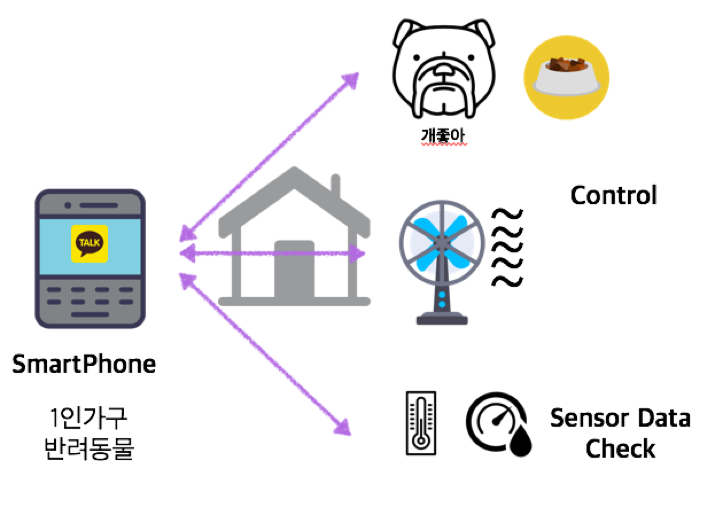
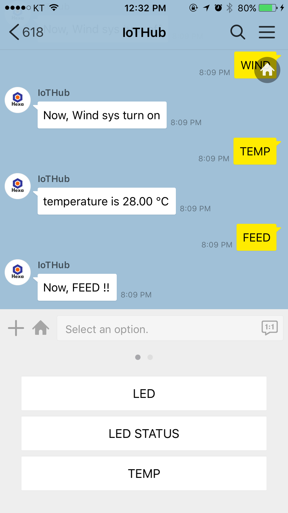
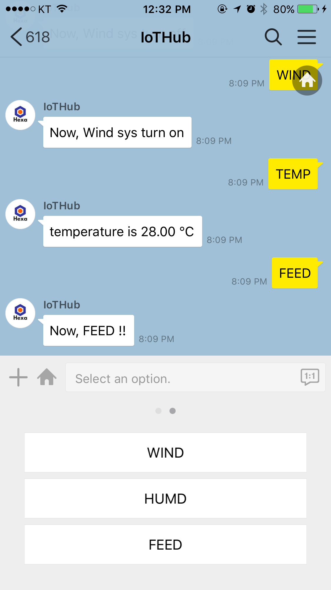

# HEXA_SmartHome_System

This is project of HEXA team in 'Microprocessor Project' Lecture

------------------

## Project Map

 이 프로젝트는 MCU(Arduino)를 통해서 집의 일부를 mobile 로 집의 상태를 확인하고 반려동물의 관리를 가능하게하여 반려동물을 키우면서 혼자 사는 사람들에게 편의를 제공하는 Smart Home system 을 만드는 프로젝트 입니다. 데모 시연 영상은 https://youtu.be/ltkpnYk4MXA 에서 시청 하실 수 있습니다.
 
 
 ------------------
 
 
 ## KaKaTalk Ex.)
 
 
 
 
